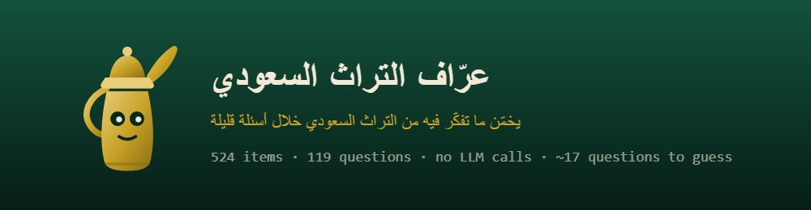

  

  <b>عرّاف التراث السعودي</b> — لعبة تخمين بمناسبة اليوم الوطني السعودي. 
  فكّر في أي شيء سعودي، وستكتشف اللعبة ما تفكّر فيه من خلال أسئلة إجابتها نعم أو لا.

  524 عنصرًا من التراث السعودي &nbsp;·&nbsp; 119 سؤالًا &nbsp;·&nbsp; بلا أي متطلبات خارجية

---

## ما هي اللعبة

ملف واحد فقط. افتحه في أي متصفح وسيعمل مباشرة — بلا خادم، وبلا خطوات تثبيت، وبلا حاجة
للاتصال بالإنترنت. ضعه على جهاز لوحي وسيبقى يعمل طوال اليوم في أي فعالية أو ركن.

تطرح اللعبة أسئلة بالعربية، وتحاول تخمين ما يفكّر فيه اللاعب من بين 524 عنصرًا من التراث
السعودي — أطعمة، أماكن، عادات، ملابس، معالم، مدن، رياضات، ورموز وطنية — من خلال ثلاثة
أزرار فقط: **نعم / لا / لا أعلم**.

الإجابة تُعالَج فورًا، فيظهر السؤال التالي دون أي تأخير محسوس.

## تغيير صورة البانر

صورة البانر أعلى هذه الصفحة هي الملف `Banner.jpeg` الموجود في جذر المستودع.

لاستبدالها: افتح الملف `Banner.jpeg` من قائمة الملفات، ثم استخدم أيقونة الحذف أو التعديل —
أو ببساطة استخدم زر **Add file** ثم **Upload files** وارفع صورة جديدة بنفس الاسم تمامًا،
`Banner.jpeg`، لتحلّ محل القديمة، ثم اعتمد التغيير (Commit). هذا الملف يشير دائمًا إلى هذا
الاسم، فسيتحدّث البانر تلقائيًا دون تعديل أي شيء آخر.

إذا رفعت الصورة الجديدة باسم مختلف أو بصيغة مختلفة (مثل `banner.png`)، عدّل السطر الذي
يحتوي على `src="Banner.jpeg"` في أعلى هذا الملف ليطابق الاسم الجديد.
